# Agent Hub processes

How each process in agent-hub works, and what happens in every case. Every diagram is Mermaid, so it renders on GitHub and Forgejo. The behaviour is as built on 2026-10-27: sesync `bridge-phase2` (`e4eb0b1`), `herdr-open` (`60478ef`), the app fork `orca-phone` `phase2` (`c726b00c`), and herdr 0.9.1. The text explains why; the diagrams show what.

| # | Process | Runs where |
|---|---|---|
| 1 | [The system at a glance](#1-the-system-at-a-glance) | every machine, the phone, k3s |
| 2 | [Open a session in herdr from the sesync TUI](#2-open-a-session-in-herdr-from-the-sesync-tui) | a machine with herdr |
| 3 | [Mirror a session to another agent (agent switch)](#3-mirror-a-session-to-another-agent-agent-switch) | sesync daemon |
| 4 | [Context fit of a copy](#4-context-fit-of-a-copy) | `sesync-conv` |
| 5 | [Attachments in a copy](#5-attachments-in-a-copy) | `sesync-conv` |
| 6 | [Turn lock](#6-turn-lock) | `sesync-lock`, every harness hook, the bridge |
| 7 | [Move a session between machines (team push and pull)](#7-move-a-session-between-machines-team-push-and-pull) | sesync on two machines, team-server |
| 8 | [Join a machine to the team](#8-join-a-machine-to-the-team) | new machine, admin machine, team-server |
| 9 | [Pair the phone](#9-pair-the-phone) | phone, bridge |
| 10 | [Phone connection and every request](#10-phone-connection-and-every-request) | phone, bridge |
| 11 | [Phone opens a session and watches the terminal](#11-phone-opens-a-session-and-watches-the-terminal) | phone, bridge, herdr |
| 12 | [Phone sends a prompt](#12-phone-sends-a-prompt) | phone, bridge, sesync-lock, herdr |
| 13 | [Approvals and questions from the phone](#13-approvals-and-questions-from-the-phone) | phone, bridge, herdr |
| 14 | [Image from the phone](#14-image-from-the-phone) | phone, bridge, agent |
| 15 | [Start a new session from the phone](#15-start-a-new-session-from-the-phone) | phone, bridge, herdr |
| 16 | [Notifications](#16-notifications) | bridge, ntfy, phone |
| 17 | [Plan usage on the phone](#17-plan-usage-on-the-phone) | one machine, bridge, phone |
| 18 | [Tests](#18-tests) | yocomsmain, yocomslaptop |

---

## 1. The system at a glance

The system has two separate paths. **Moving sessions between machines** goes through the team server as sealed, end-to-end encrypted records. **Live control from the phone** goes straight to the bridge on the machine running the agent. Every machine runs only herdr and sesync; the bridge is part of sesync.

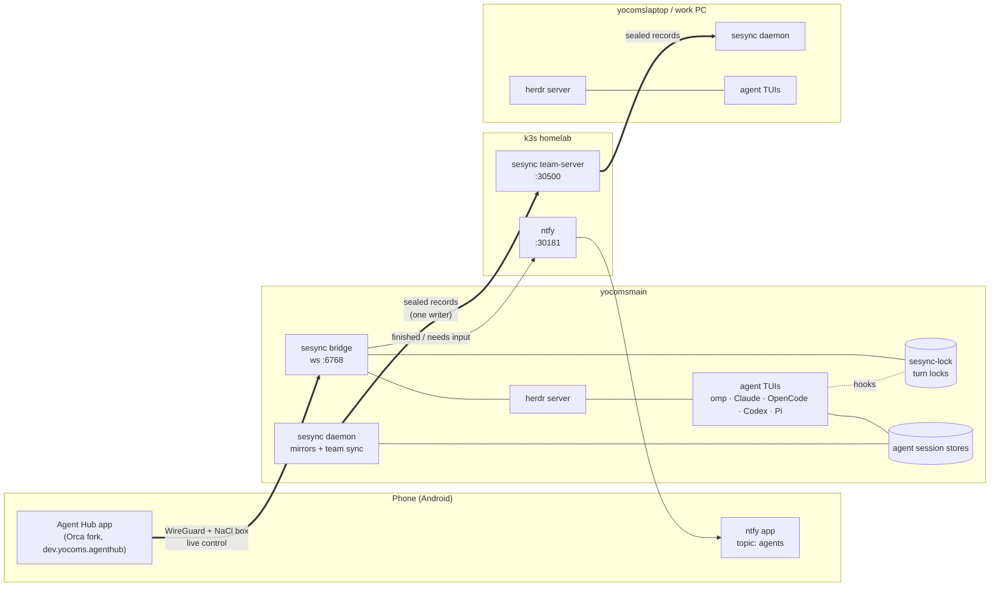
```mermaid
flowchart LR
  subgraph Phone["Phone (Android)"]
    APP["Agent Hub app<br/>(Orca fork, dev.yocoms.agenthub)"]
    NTFYAPP["ntfy app<br/>topic: agents"]
  end

  subgraph M1["yocomsmain"]
    direction TB
    BR1["sesync bridge<br/>ws :6768"]
    D1["sesync daemon<br/>mirrors + team sync"]
    L1[("sesync-lock<br/>turn locks")]
    H1["herdr server"]
    T1["agent TUIs<br/>omp · Claude · OpenCode · Codex · Pi"]
    S1[("agent session stores")]
    H1 --- T1
    T1 --- S1
    D1 --- S1
    BR1 --- H1
    BR1 --- L1
    T1 -. hooks .- L1
  end

  subgraph M2["yocomslaptop / work PC"]
    direction TB
    D2["sesync daemon"]
    H2["herdr server"]
    T2["agent TUIs"]
    H2 --- T2
  end

  subgraph K3S["k3s homelab"]
    TS["sesync team-server<br/>:30500"]
    NTFY["ntfy<br/>:30181"]
  end

  APP == "WireGuard + NaCl box<br/>live control" ==> BR1
  D1 == "sealed records<br/>(one writer)" ==> TS
  TS == "sealed records" ==> D2
  BR1 -- "finished / needs input" --> NTFY
  NTFY --> NTFYAPP
```

---

## 2. Open a session in herdr from the sesync TUI

Press `ctrl+alt+s` in herdr to open the sesync TUI as a popup. Pick a session, then choose **Open in herdr** (the first row of the session menu, or the `o` key). sesync never starts a second process on a session that is already running: if a pane already runs it, sesync focuses that pane's tab.

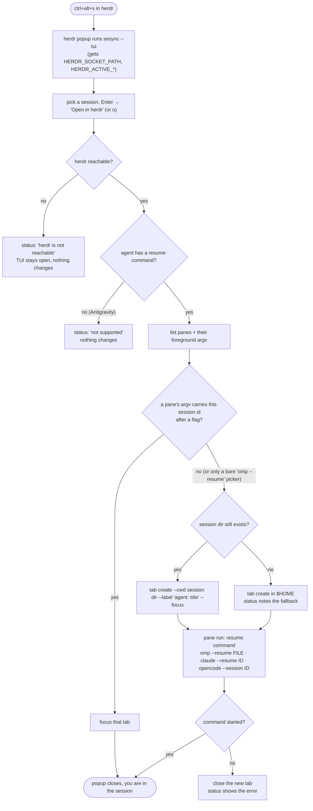
```mermaid
flowchart TD
  A(["ctrl+alt+s in herdr"]) --> B["herdr popup runs sesync --tui<br/>(gets HERDR_SOCKET_PATH, HERDR_ACTIVE_*)"]
  B --> C["pick a session, Enter → 'Open in herdr' (or o)"]
  C --> D{"herdr reachable?"}
  D -- no --> D1["status: 'herdr is not reachable'<br/>TUI stays open, nothing changes"]
  D -- yes --> E{"agent has a resume command?"}
  E -- "no (Antigravity)" --> E1["status: 'not supported'<br/>nothing changes"]
  E -- yes --> F["list panes + their foreground argv"]
  F --> G{"a pane's argv carries this session id<br/>after a flag?"}
  G -- yes --> H["focus that tab"]
  G -- "no (or only a bare 'omp --resume' picker)" --> I{"session dir still exists?"}
  I -- yes --> J["tab create --cwd session dir --label 'agent: title' --focus"]
  I -- no --> J2["tab create in $HOME<br/>status notes the fallback"]
  J --> K["pane run: resume command<br/>omp --resume FILE · claude --resume ID · opencode --session ID"]
  J2 --> K
  K --> L{"command started?"}
  L -- yes --> M(["popup closes, you are in the session"])
  L -- no --> N["close the new tab<br/>status shows the error"]
  H --> M
```

**Known limit:** after a reboot, herdr restores its tab *layout* but not the programs that were running. A restored tab is a plain shell, so Open starts the session in a new tab.

---

## 3. Mirror a session to another agent (agent switch)

Each conversation has **one source**, its parent session. Copies in other agents are derived data. A copy becomes the new source **only when you type a prompt in it**. To switch agents: mirror the session, open the copy in herdr, and prompt there.

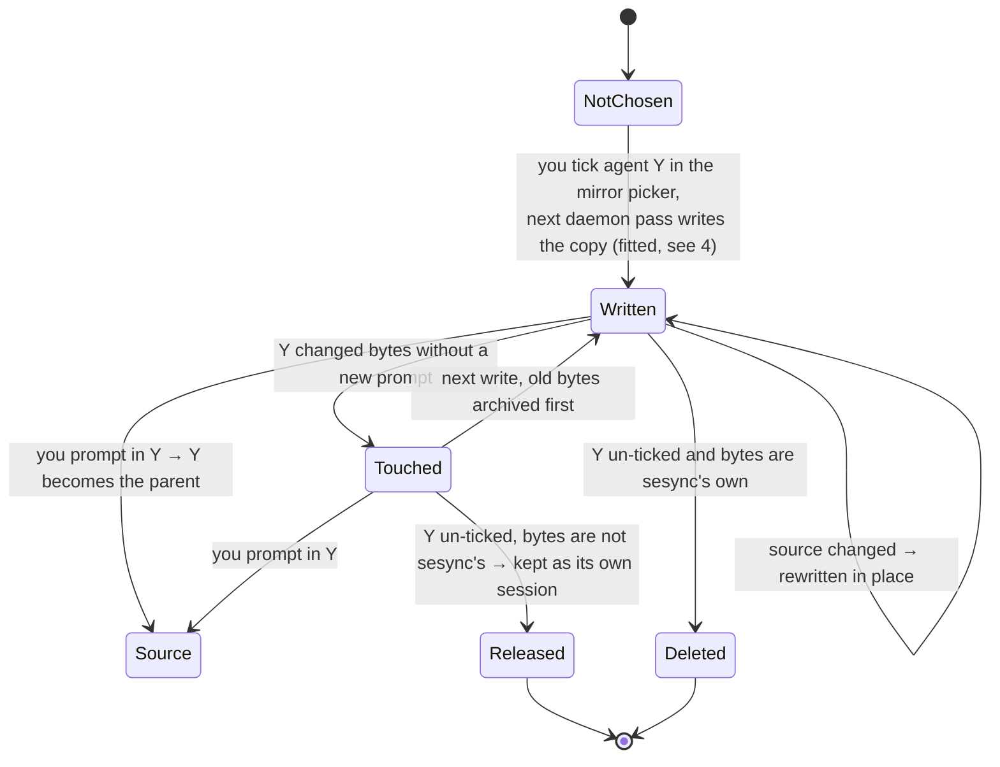
```mermaid
stateDiagram-v2
  [*] --> NotChosen
  NotChosen --> Written: you tick agent Y in the mirror picker,<br/>next daemon pass writes the copy (fitted, see 4)
  Written --> Written: source changed → rewritten in place
  Written --> Touched: Y changed bytes without a new prompt
  Touched --> Written: next write, old bytes archived first
  Written --> Source: you prompt in Y → Y becomes the parent
  Touched --> Source: you prompt in Y
  Written --> Deleted: Y un-ticked and bytes are sesync's own
  Touched --> Released: Y un-ticked, bytes are not sesync's → kept as its own session
  Released --> [*]
  Deleted --> [*]
```

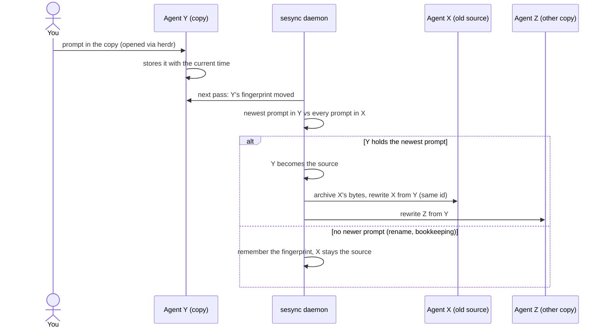
```mermaid
sequenceDiagram
  actor U as You
  participant Y as Agent Y (copy)
  participant D as sesync daemon
  participant X as Agent X (old source)
  participant Z as Agent Z (other copy)
  U->>Y: prompt in the copy (opened via herdr)
  Y->>Y: stores it with the current time
  D->>Y: next pass: Y's fingerprint moved
  D->>D: newest prompt in Y vs every prompt in X
  alt Y holds the newest prompt
    D->>D: Y becomes the source
    D->>X: archive X's bytes, rewrite X from Y (same id)
    D->>Z: rewrite Z from Y
  else no newer prompt (rename, bookkeeping)
    D->>D: remember the fingerprint, X stays the source
  end
```

---

## 4. Context fit of a copy

A copy written into another agent must fit that agent's context window. Before this rule, a copy took the whole history, e.g. 810k tokens into Claude's 200k window. A copy now keeps the **latest compaction summary plus the newest turns that fit**. If even that cannot fit, sesync refuses: the existing copy stays as it was, and the mirror shows a failure.

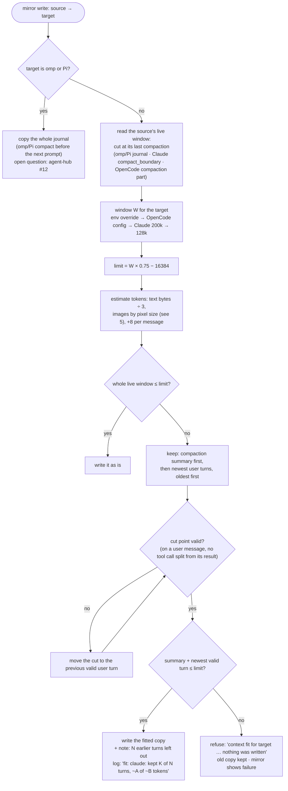
```mermaid
flowchart TD
  A(["mirror write: source → target"]) --> B{"target is omp or Pi?"}
  B -- yes --> B1["copy the whole journal<br/>(omp/Pi compact before the next prompt)<br/>open question: agent-hub #12"]
  B -- no --> C["read the source's live window:<br/>cut at its last compaction<br/>(omp/Pi journal · Claude compact_boundary · OpenCode compaction part)"]
  C --> D["window W for the target<br/>env override → OpenCode config → Claude 200k → 128k"]
  D --> E["limit = W × 0.75 − 16384"]
  E --> F["estimate tokens: text bytes ÷ 3,<br/>images by pixel size (see 5), +8 per message"]
  F --> G{"whole live window ≤ limit?"}
  G -- yes --> H["write it as is"]
  G -- no --> I["keep: compaction summary first,<br/>then newest user turns, oldest first"]
  I --> J{"cut point valid?<br/>(on a user message, no tool call split from its result)"}
  J -- no --> I2["move the cut to the previous valid user turn"] --> J
  J -- yes --> K{"summary + newest valid turn ≤ limit?"}
  K -- yes --> L["write the fitted copy<br/>+ note: N earlier turns left out<br/>log: 'fit: claude: kept K of N turns, ~A of ~B tokens'"]
  K -- no --> M["refuse: 'context fit for target … nothing was written'<br/>old copy kept · mirror shows failure"]
```

Measured on the DoppleClanker OpenCode session, copied into Claude:

| | Before | After |
|---|---|---|
| Copy size | 21 MB | 324 KB |
| Estimated tokens | ~810,700 | ~75,400 (limit 79,616) |
| Turns kept | all 33 | summary + newest 7 |

---

## 5. Attachments in a copy

Images are copied byte for byte. Anything a target cannot take leaves a **visible note in the same place**, so nothing disappears silently.

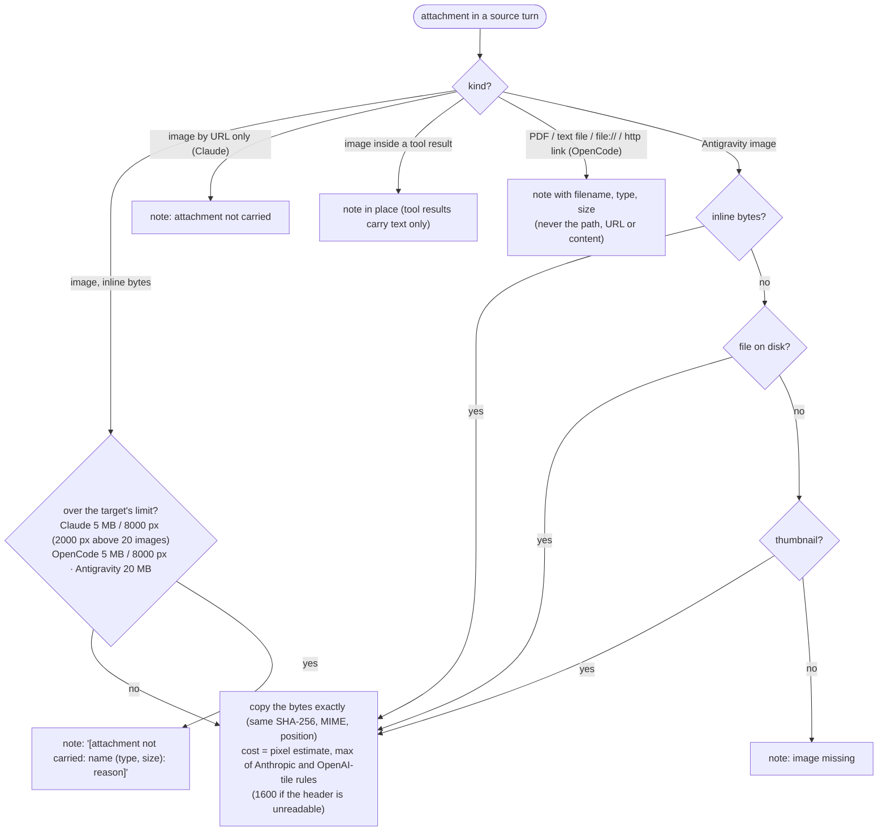
```mermaid
flowchart TD
  A(["attachment in a source turn"]) --> B{"kind?"}
  B -- "image, inline bytes" --> C{"over the target's limit?<br/>Claude 5 MB / 8000 px (2000 px above 20 images)<br/>OpenCode 5 MB / 8000 px · Antigravity 20 MB"}
  C -- no --> D["copy the bytes exactly (same SHA-256, MIME, position)<br/>cost = pixel estimate, max of Anthropic and OpenAI-tile rules<br/>(1600 if the header is unreadable)"]
  C -- yes --> N1["note: '[attachment not carried: name (type, size): reason]'"]
  B -- "image by URL only (Claude)" --> N2["note: attachment not carried"]
  B -- "image inside a tool result" --> N3["note in place (tool results carry text only)"]
  B -- "PDF / text file / file:// / http link (OpenCode)" --> N4["note with filename, type, size<br/>(never the path, URL or content)"]
  B -- "Antigravity image" --> F{"inline bytes?"}
  F -- yes --> D
  F -- no --> G{"file on disk?"}
  G -- yes --> D
  G -- no --> H{"thumbnail?"}
  H -- yes --> D
  H -- no --> N5["note: image missing"]
```

Checked on the operator's 5 real omp sessions (read-only): 20 user images in, 20 out, identical hashes, in both Claude and OpenCode; 27 tool-result images became 27 notes.

---

## 6. Turn lock

At most one writer per conversation at a time, whether that is a TUI, the daemon or the phone. A lock is held **only during a turn**: claimed when a prompt is sent, released when the turn ends. Locks are files with a PID inside, so a crashed holder frees its lock automatically. The lock fails closed: if the lock tool cannot run, the write is skipped.

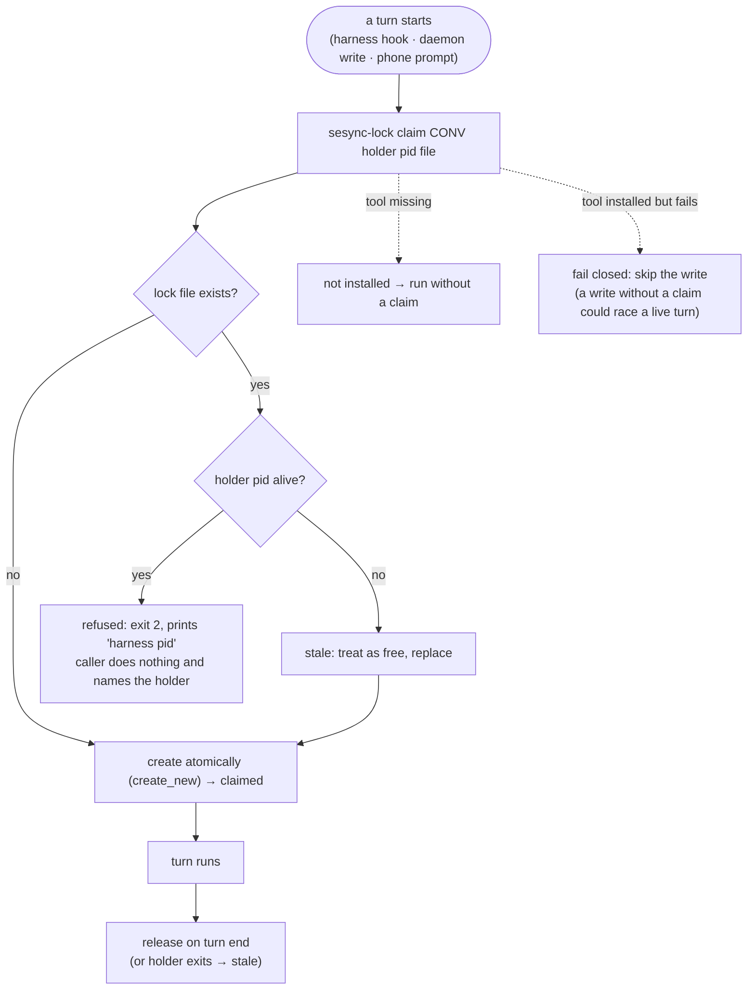
```mermaid
flowchart TD
  A(["a turn starts<br/>(harness hook · daemon write · phone prompt)"]) --> B["sesync-lock claim CONV holder pid file"]
  B --> C{"lock file exists?"}
  C -- no --> OK["create atomically (create_new) → claimed"]
  C -- yes --> D{"holder pid alive?"}
  D -- no --> E["stale: treat as free, replace"] --> OK
  D -- yes --> R["refused: exit 2, prints 'harness pid'<br/>caller does nothing and names the holder"]
  B -. "tool missing" .-> F["not installed → run without a claim"]
  B -. "tool installed but fails" .-> G["fail closed: skip the write<br/>(a write without a claim could race a live turn)"]
  OK --> T["turn runs"]
  T --> REL["release on turn end<br/>(or holder exits → stale)"]
```

---

## 7. Move a session between machines (team push and pull)

A session marked for the team is sealed on the source machine: encrypted to every device in the admin-signed member list. The server stores records it cannot read, and grants **one write lease at a time**. Importing on another machine is always a separate step you confirm.

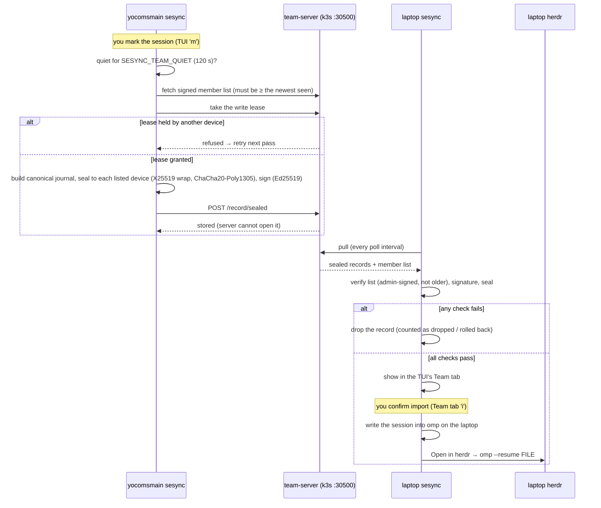
```mermaid
sequenceDiagram
  participant A as yocomsmain sesync
  participant TS as team-server (k3s :30500)
  participant B as laptop sesync
  participant H as laptop herdr
  Note over A: you mark the session (TUI 'm')
  A->>A: quiet for SESYNC_TEAM_QUIET (120 s)?
  A->>TS: fetch signed member list (must be ≥ the newest seen)
  A->>TS: take the write lease
  alt lease held by another device
    TS-->>A: refused → retry next pass
  else lease granted
    A->>A: build canonical journal, seal to each listed device (X25519 wrap, ChaCha20-Poly1305), sign (Ed25519)
    A->>TS: POST /record/sealed
    TS-->>A: stored (server cannot open it)
  end
  B->>TS: pull (every poll interval)
  TS-->>B: sealed records + member list
  B->>B: verify list (admin-signed, not older), signature, seal
  alt any check fails
    B->>B: drop the record (counted as dropped / rolled back)
  else all checks pass
    B->>B: show in the TUI's Team tab
    Note over B: you confirm import (Team tab 'i')
    B->>B: write the session into omp on the laptop
    B->>H: Open in herdr → omp --resume FILE
  end
```

Verified 2026-10-26: a throwaway session pushed from yocomsmain arrived on the laptop. It opened in the laptop's herdr as `omp --resume …/2026-10-26T10-00-00-000Z_c29e4365-….jsonl`, in the tab "omp: agenthub proof small".

**Crypto note:** the key wrap is classical (X25519) and the signatures are Ed25519. Before phone traffic uses team records, the wrap becomes hybrid X25519 + ML-KEM-768 (agent-hub #6).

---

## 8. Join a machine to the team

The team code proves only that the person joining was given it. Admission is the admin's decision. The admin signs the new device's key into the next version of the member list, after comparing fingerprints out of band.

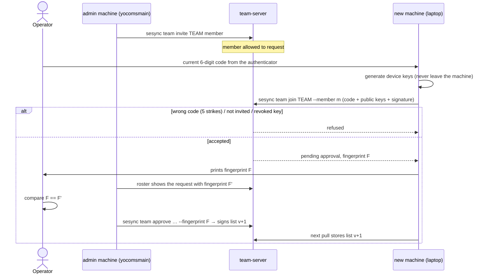
```mermaid
sequenceDiagram
  actor Op as Operator
  participant Adm as admin machine (yocomsmain)
  participant TS as team-server
  participant New as new machine (laptop)
  Adm->>TS: sesync team invite TEAM member
  Note over TS: member allowed to request
  Op->>New: current 6-digit code from the authenticator
  New->>New: generate device keys (never leave the machine)
  New->>TS: sesync team join TEAM --member m  (code + public keys + signature)
  alt wrong code (5 strikes) / not invited / revoked key
    TS-->>New: refused
  else accepted
    TS-->>New: pending approval, fingerprint F
    New->>Op: prints fingerprint F
    Adm->>TS: roster shows the request with fingerprint F'
    Op->>Op: compare F == F'
    Adm->>TS: sesync team approve … --fingerprint F → signs list v+1
    New->>TS: next pull stores list v+1
  end
```

---

## 9. Pair the phone

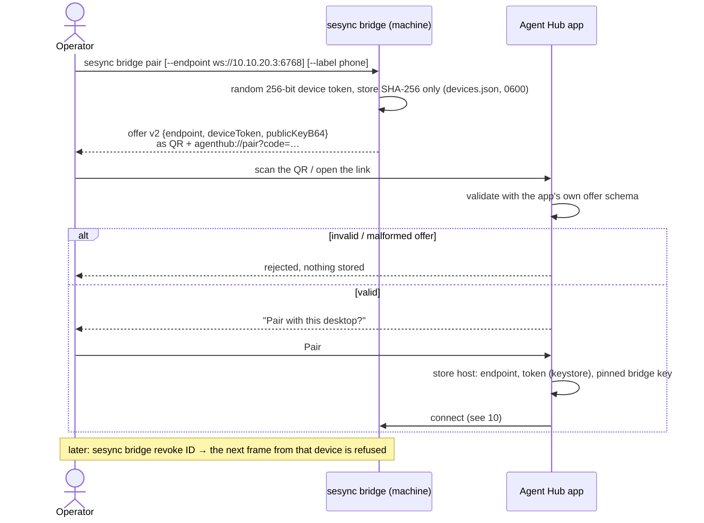
```mermaid
sequenceDiagram
  actor Op as Operator
  participant BR as sesync bridge (machine)
  participant App as Agent Hub app
  Op->>BR: sesync bridge pair [--endpoint ws://10.10.20.3:6768] [--label phone]
  BR->>BR: random 256-bit device token, store SHA-256 only (devices.json, 0600)
  BR-->>Op: offer v2 {endpoint, deviceToken, publicKeyB64}<br/>as QR + agenthub://pair?code=…
  Op->>App: scan the QR / open the link
  App->>App: validate with the app's own offer schema
  alt invalid / malformed offer
    App-->>Op: rejected, nothing stored
  else valid
    App-->>Op: "Pair with this desktop?"
    Op->>App: Pair
    App->>App: store host: endpoint, token (keystore), pinned bridge key
    App->>BR: connect (see 10)
  end
  Note over Op,BR: later: sesync bridge revoke ID → the next frame from that device is refused
```

---

## 10. Phone connection and every request

The connection is a WebSocket inside WireGuard, with NaCl-box encryption on top. The device token is checked **on every frame**, so a revoke takes effect immediately.

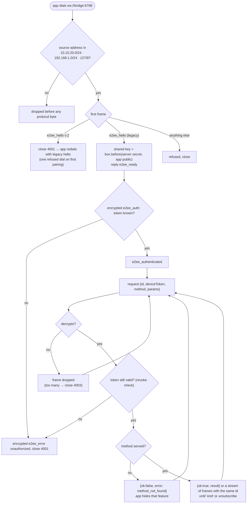
```mermaid
flowchart TD
  A(["app dials ws://bridge:6768"]) --> B{"source address in<br/>10.10.20.0/24 · 192.168.1.0/24 · 127/8?"}
  B -- no --> X1["dropped before any protocol byte"]
  B -- yes --> C{"first frame"}
  C -- "e2ee_hello v:2" --> X2["close 4001 → app redials with legacy hello<br/>(one refused dial on first pairing)"]
  C -- "e2ee_hello (legacy)" --> D["shared key = box.before(server secret, app public)<br/>reply e2ee_ready"]
  C -- "anything else" --> X3["refused, close"]
  D --> E{"encrypted e2ee_auth: token known?"}
  E -- no --> X4["encrypted e2ee_error unauthorized, close 4001"]
  E -- yes --> F["e2ee_authenticated"]
  F --> G["request {id, deviceToken, method, params}"]
  G --> H{"decrypts?"}
  H -- no --> H1["frame dropped<br/>(too many → close 4003)"] --> G
  H -- yes --> I{"token still valid? (revoke check)"}
  I -- no --> X4
  I -- yes --> J{"method served?"}
  J -- no --> J1["{ok:false, error: method_not_found}<br/>app hides that feature"] --> G
  J -- yes --> K["{ok:true, result} or a stream of frames with the same id<br/>until 'end' or unsubscribe"] --> G
```

---

## 11. Phone opens a session and watches the terminal

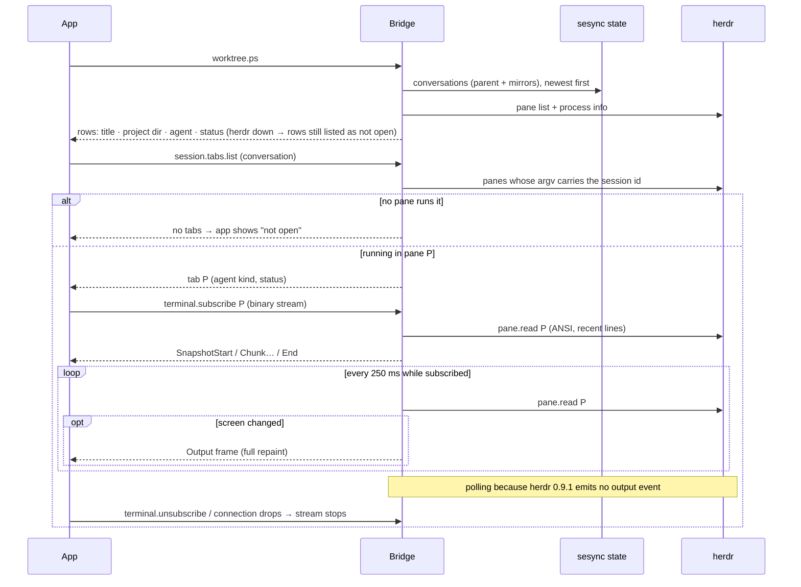
```mermaid
sequenceDiagram
  participant App as App
  participant BR as Bridge
  participant SS as sesync state
  participant H as herdr
  App->>BR: worktree.ps
  BR->>SS: conversations (parent + mirrors), newest first
  BR->>H: pane list + process info
  BR-->>App: rows: title · project dir · agent · status (herdr down → rows still listed as not open)
  App->>BR: session.tabs.list (conversation)
  BR->>H: panes whose argv carries the session id
  alt no pane runs it
    BR-->>App: no tabs → app shows "not open"
  else running in pane P
    BR-->>App: tab P (agent kind, status)
    App->>BR: terminal.subscribe P (binary stream)
    BR->>H: pane.read P (ANSI, recent lines)
    BR-->>App: SnapshotStart / Chunk… / End
    loop every 250 ms while subscribed
      BR->>H: pane.read P
      opt screen changed
        BR-->>App: Output frame (full repaint)
      end
    end
    Note over BR,H: polling because herdr 0.9.1 emits no output event
    App->>BR: terminal.unsubscribe / connection drops → stream stops
  end
```

---

## 12. Phone sends a prompt

The prompt goes **into the running agent**, never into a copy. That is the fix for the Happier fork problem (it duplicated the whole session to deliver one message).

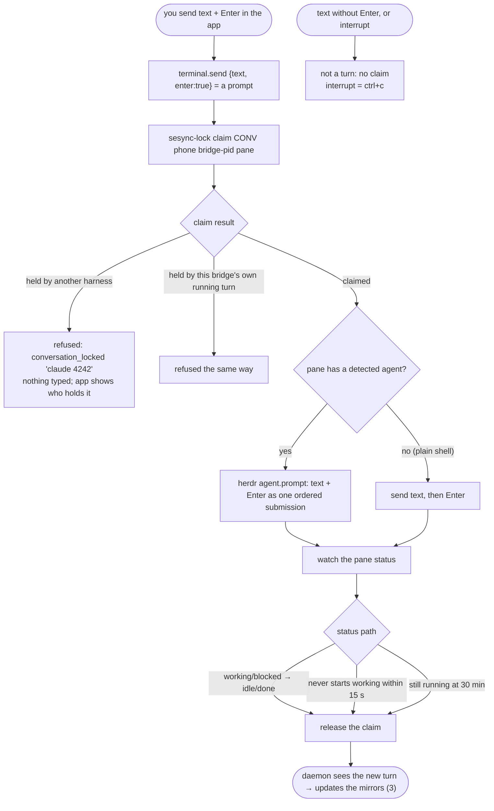
```mermaid
flowchart TD
  A(["you send text + Enter in the app"]) --> B["terminal.send {text, enter:true} = a prompt"]
  B --> C["sesync-lock claim CONV phone bridge-pid pane"]
  C --> D{"claim result"}
  D -- "held by another harness" --> R1["refused: conversation_locked 'claude 4242'<br/>nothing typed; app shows who holds it"]
  D -- "held by this bridge's own running turn" --> R2["refused the same way"]
  D -- claimed --> E{"pane has a detected agent?"}
  E -- yes --> F["herdr agent.prompt: text + Enter as one ordered submission"]
  E -- "no (plain shell)" --> G["send text, then Enter"]
  F --> W["watch the pane status"]
  G --> W
  W --> S{"status path"}
  S -- "working/blocked → idle/done" --> REL["release the claim"]
  S -- "never starts working within 15 s" --> REL
  S -- "still running at 30 min" --> REL
  REL --> Z(["daemon sees the new turn → updates the mirrors (3)"])
  B2(["text without Enter, or interrupt"]) --> N["not a turn: no claim<br/>interrupt = ctrl+c"]
```

---

## 13. Approvals and questions from the phone

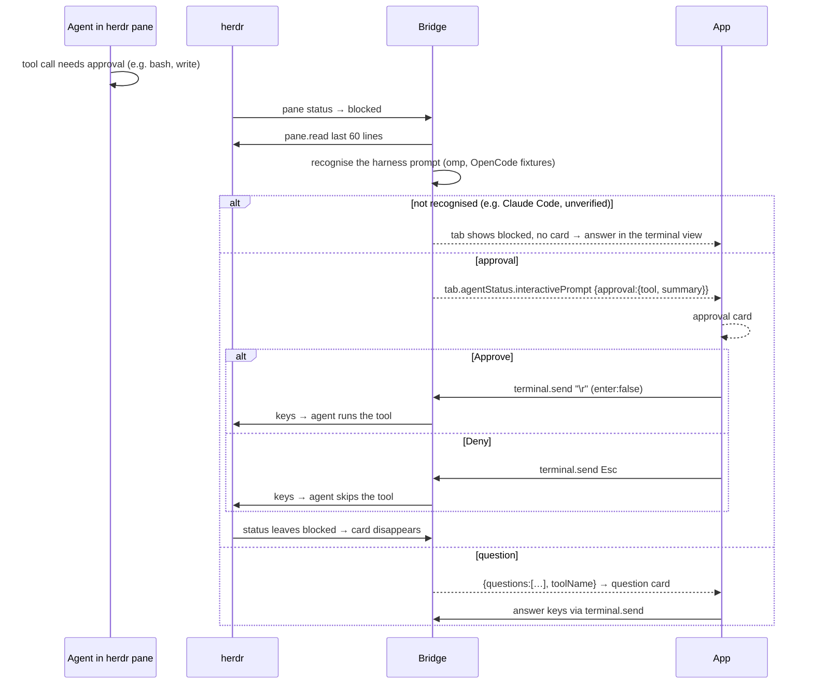
```mermaid
sequenceDiagram
  participant Ag as Agent in herdr pane
  participant H as herdr
  participant BR as Bridge
  participant App as App
  Ag->>Ag: tool call needs approval (e.g. bash, write)
  H->>BR: pane status → blocked
  BR->>H: pane.read last 60 lines
  BR->>BR: recognise the harness prompt (omp, OpenCode fixtures)
  alt not recognised (e.g. Claude Code, unverified)
    BR-->>App: tab shows blocked, no card → answer in the terminal view
  else approval
    BR-->>App: tab.agentStatus.interactivePrompt {approval:{tool, summary}}
    App-->>App: approval card
    alt Approve
      App->>BR: terminal.send "\r" (enter:false)
      BR->>H: keys → agent runs the tool
    else Deny
      App->>BR: terminal.send Esc
      BR->>H: keys → agent skips the tool
    end
    H->>BR: status leaves blocked → card disappears
  else question
    BR-->>App: {questions:[…], toolName} → question card
    App->>BR: answer keys via terminal.send
  end
```

Verified against fake-model with omp: **deny means no file is written; approve means the file is written.**

---

## 14. Image from the phone

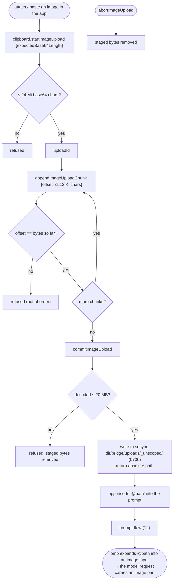
```mermaid
flowchart TD
  A(["attach / paste an image in the app"]) --> B["clipboard.startImageUpload {expectedBase64Length}"]
  B --> C{"≤ 24 Mi base64 chars?"}
  C -- no --> X1["refused"]
  C -- yes --> D["uploadId"]
  D --> E["appendImageUploadChunk {offset, ≤512 Ki chars}"]
  E --> F{"offset == bytes so far?"}
  F -- no --> X2["refused (out of order)"]
  F -- yes --> G{"more chunks?"}
  G -- yes --> E
  G -- no --> H["commitImageUpload"]
  H --> I{"decoded ≤ 20 MB?"}
  I -- no --> X3["refused, staged bytes removed"]
  I -- yes --> J["write to sesync dir/bridge/uploads/_unscoped/ (0700)<br/>return absolute path"]
  J --> K["app inserts '@path' into the prompt"]
  K --> L["prompt flow (12)"]
  L --> M(["omp expands @path into an image input<br/>→ the model request carries an image part"])
  A2(["abortImageUpload"]) --> X4["staged bytes removed"]
```

---

## 15. Start a new session from the phone

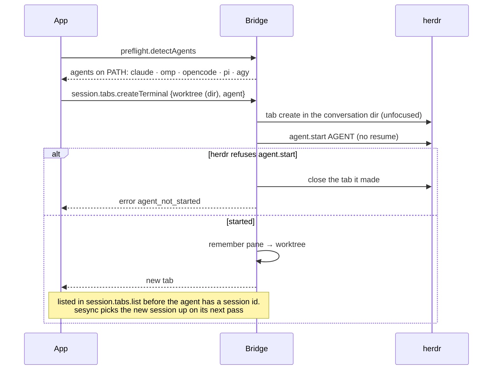
```mermaid
sequenceDiagram
  participant App as App
  participant BR as Bridge
  participant H as herdr
  App->>BR: preflight.detectAgents
  BR-->>App: agents on PATH: claude · omp · opencode · pi · agy
  App->>BR: session.tabs.createTerminal {worktree (dir), agent}
  BR->>H: tab create in the conversation dir (unfocused)
  BR->>H: agent.start AGENT (no resume)
  alt herdr refuses agent.start
    BR->>H: close the tab it made
    BR-->>App: error agent_not_started
  else started
    BR->>BR: remember pane → worktree
    BR-->>App: new tab
    Note over App,BR: listed in session.tabs.list before the agent has a session id.<br/>sesync picks the new session up on its next pass
  end
```

---

## 16. Notifications

The watcher follows herdr's status events rather than sampling. A sample every 250 ms could miss a turn that starts and ends between two samples; the live run had no finished frame for one. The pane list is still read every second, to follow panes that open or close.

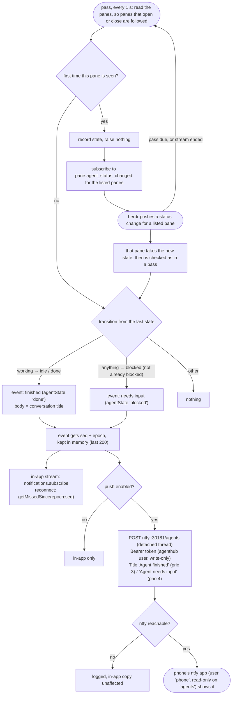
```mermaid
flowchart TD
  A(["pass, every 1 s: read the panes, so panes that open or close are followed"]) --> B{"first time this pane is seen?"}
  B -- yes --> B1["record state, raise nothing"]
  B -- no --> C{"transition from the last state"}
  B1 --> S["subscribe to pane.agent_status_changed for the listed panes"]
  S --> W(["herdr pushes a status change for a listed pane"])
  W --> U["that pane takes the new state, then is checked as in a pass"]
  U --> C
  W -- "pass due, or stream ended" --> A
  C -- "working → idle / done" --> F["event: finished (agentState 'done')<br/>body = conversation title"]
  C -- "anything → blocked (not already blocked)" --> N["event: needs input (agentState 'blocked')"]
  C -- "other" --> Z["nothing"]
  F --> Q["event gets seq + epoch, kept in memory (last 200)"]
  N --> Q
  Q --> I["in-app stream: notifications.subscribe<br/>reconnect: getMissedSince(epoch:seq)"]
  Q --> P{"push enabled?"}
  P -- no --> P0["in-app only"]
  P -- yes --> P1["POST ntfy :30181/agents (detached thread)<br/>Bearer token (agenthub user, write-only)<br/>Title 'Agent finished' (prio 3) / 'Agent needs input' (prio 4)"]
  P1 --> P2{"ntfy reachable?"}
  P2 -- no --> P3["logged, in-app copy unaffected"]
  P2 -- yes --> P4(["phone's ntfy app (user 'phone', read-only on 'agents') shows it"])
```

---

## 17. Plan usage on the phone

The phone holds **no provider keys**. One machine fetches usage, and the phone only reads the result.

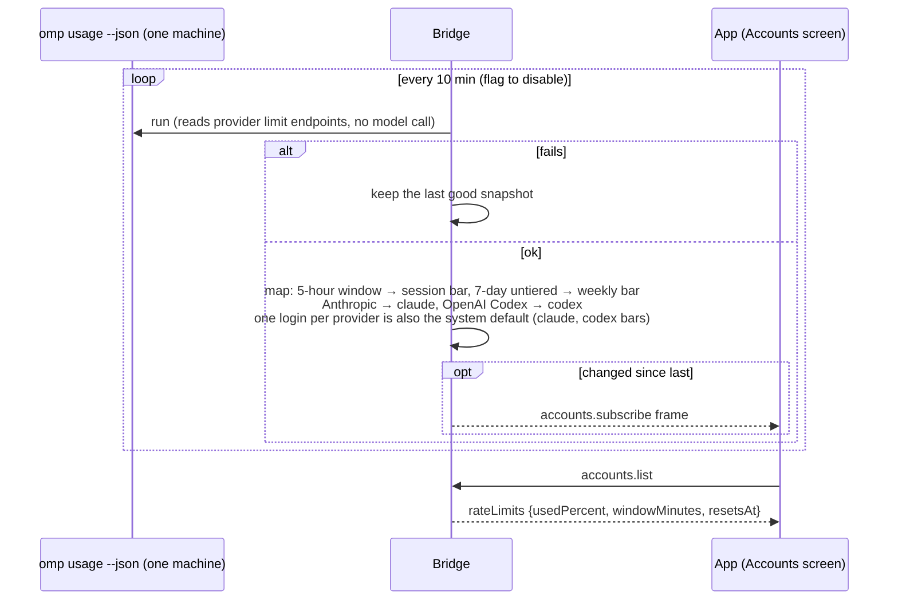
```mermaid
sequenceDiagram
  participant Omp as omp usage --json (one machine)
  participant BR as Bridge
  participant App as App (Accounts screen)
  loop every 10 min (flag to disable)
    BR->>Omp: run (reads provider limit endpoints, no model call)
    alt fails
      BR->>BR: keep the last good snapshot
    else ok
      BR->>BR: map: 5-hour window → session bar, 7-day untiered → weekly bar<br/>Anthropic → claude, OpenAI Codex → codex<br/>one login per provider is also the system default (claude, codex bars)
      opt changed since last
        BR-->>App: accounts.subscribe frame
      end
    end
  end
  App->>BR: accounts.list
  BR-->>App: rateLimits {usedPercent, windowMinutes, resetsAt}
```

The mapping is built from omp's source; no live omp run has checked it yet.

---

## 18. Tests

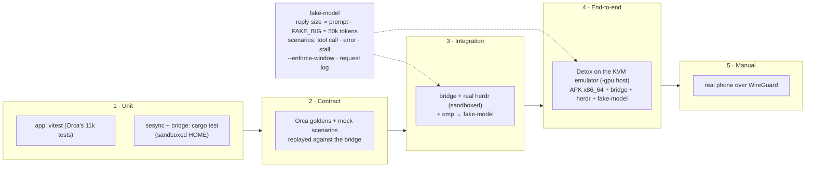
```mermaid
flowchart LR
  subgraph L1["1 · Unit"]
    U1["app: vitest (Orca's 11k tests)"]
    U2["sesync + bridge: cargo test<br/>(sandboxed HOME)"]
  end
  subgraph L2["2 · Contract"]
    C1["Orca goldens + mock scenarios<br/>replayed against the bridge"]
  end
  subgraph L3["3 · Integration"]
    I1["bridge + real herdr (sandboxed)<br/>+ omp → fake-model"]
  end
  subgraph L4["4 · End-to-end"]
    E1["Detox on the KVM emulator (-gpu host)<br/>APK x86_64 + bridge + herdr + fake-model"]
  end
  subgraph L5["5 · Manual"]
    M1["real phone over WireGuard"]
  end
  L1 --> L2 --> L3 --> L4 --> L5
  FM["fake-model<br/>reply size ∝ prompt · FAKE_BIG = 50k tokens<br/>scenarios: tool call · error · stall<br/>--enforce-window · request log"] -.-> I1
  FM -.-> E1
```

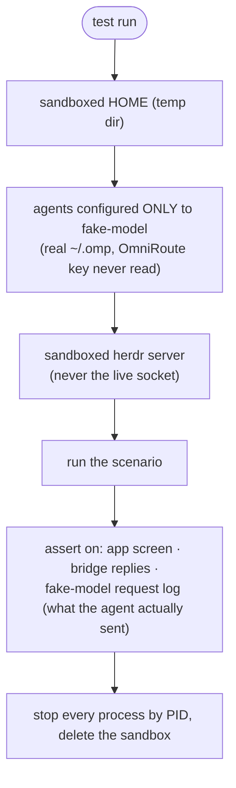
```mermaid
flowchart TD
  A(["test run"]) --> B["sandboxed HOME (temp dir)"]
  B --> C["agents configured ONLY to fake-model<br/>(real ~/.omp, OmniRoute key never read)"]
  C --> D["sandboxed herdr server<br/>(never the live socket)"]
  D --> E["run the scenario"]
  E --> F["assert on: app screen · bridge replies ·<br/>fake-model request log (what the agent actually sent)"]
  F --> G["stop every process by PID, delete the sandbox"]
```
